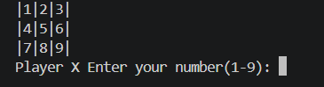
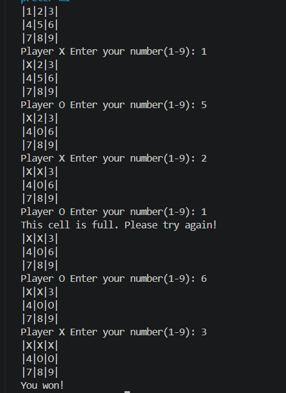

# Tic Tac Toe Game (C++)
A simple console-based Tic Tac Toe game written in C++ using OOP principles.

## Features
- 2 player mode (X and O)
- Win, draw detection (rows, columns)
- Input validation
- Simple console 
- Object Oriented Programming (OOP)

## How the game works
Players choose numbers from 1 to 9 to place X or O on the board.
The first player to align 3 symbols wins.

## How to run
Compile:
g++ main.cpp -o game
Run:
./game

## Technologies Used
- C++
- Object Oriented Programming
- Console Application

## Purpose
This project was created to improve my C++ and object-oriented programming (OOP) skills.

## Screenshots
 
